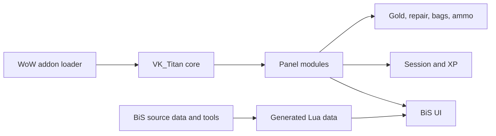

# VK Titan Addon Suite

VK Titan is a World of Warcraft TBC Classic Anniversary addon suite built around a custom Titan-style panel. It includes multiple Lua/XML modules for player information, inventory, economy, repair, session tracking, XP tracking, and Best-in-Slot item guidance.

The project demonstrates practical addon development, UI scripting, game API usage, data-driven Lua modules, and iterative tool building for a specific user workflow.

## Problem The Project Solves

World of Warcraft players often want lightweight in-game status panels and quick access to character information without opening multiple UI windows. This addon suite experiments with a custom Titan-style panel and small focused modules for common gameplay information.

## Key Features

- Core `VK_Titan` panel framework.
- XP tracking module for experience progress.
- Gold, repair, bags, ammo, and session modules.
- Classic/TBC support module used by other addons.
- Best-in-Slot module with class/spec/phase selection.
- Gem and enchant recommendation data for BiS entries.
- Python/Lua data generation tools for BiS-related datasets.
- PowerShell deploy helper for copying addon folders into a local WoW installation.

## Demo And Screenshots

Screenshots are not committed yet. Recommended screenshots to add under `docs/images/`:

- `titan-bar.png`: in-game Titan-style bar with enabled modules.
- `bis-window.png`: Best-in-Slot window with class, spec, phase, and slot navigation visible.
- `session-xp.png`: session or XP tracking module in use.
- `repair-gold-bag.png`: repair, gold, and bag modules visible on the panel.

Do not include screenshots that show private chat, account names, character names you do not want public, guild chat, BattleTag information, or private server details.

## Architecture



## Technology Stack

- Lua
- World of Warcraft addon API
- XML UI definitions
- `.toc` addon manifests
- PowerShell deploy helper
- Python helper scripts for generating BiS data
- CSV/Lua data files

## Project Structure

```text
VK_Titan/              Core panel addon
VK_TitanClassic/       Shared compatibility/support module
VK_TitanAmmo/          Ammo module
VK_TitanBag/           Bag module
VK_TitanBiS/           Best-in-Slot UI and data
VK_TitanGold/          Gold module
VK_TitanRepair/        Repair module
VK_TitanSession/       Session tracking module
VK_TitanXP/            XP module
deploy.ps1            Local deployment helper
docs/images/           Placeholder location for screenshots
```

## Prerequisites

- World of Warcraft TBC Classic Anniversary installation.
- Addon development enabled through the standard `Interface/AddOns` folder.
- PowerShell if using `deploy.ps1`.

## Installation

Manual installation:

1. Copy each `VK_Titan*` addon folder into your WoW `Interface/AddOns` directory.
2. Start or reload the game.
3. Enable the addons on the character selection screen.
4. Use `/reload` after replacing files while testing.

PowerShell helper:

```powershell
.\deploy.ps1
```

Custom addon path:

```powershell
.\deploy.ps1 -AddonPath "D:\Games\World of Warcraft\_anniversary_\Interface\AddOns"
```

## Configuration

The core addon uses WoW saved variables for local UI state. SavedVariables are local user data and should not be committed to Git.

## Testing

This project does not currently have automated tests. Recommended manual checks:

- Confirm all addon folders appear in the WoW addon list.
- Enable `VK_Titan`, `VK_TitanClassic`, and the module being tested.
- Log into a character and confirm the panel loads without Lua errors.
- Test each module individually.
- Open the BiS window and switch class, spec, phase, budget mode, and item slots.
- Run `/reload` after deployment and confirm saved state still behaves as expected.

## Security And Privacy Considerations

- Do not commit WoW SavedVariables, account information, screenshots with private chat, or character/account identifiers you do not want public.
- The deployment script copies local files only; review the `-AddonPath` value before running it.
- Generated BiS data should be reviewed before publishing if it is imported from external tools or websites.

## Current Limitations

- No automated test suite is included.
- The project depends on WoW/TBC addon APIs, so most behavior must be verified in-game.
- Some BiS data is generated and may need regular review as item data, phases, or assumptions change.
- Documentation and screenshots are still being added.

## Future Improvements

- Add screenshots and a short demo walkthrough.
- Add a changelog for each addon module.
- Add clearer slash commands or in-game help text if supported by the addon.
- Add data validation checks for generated BiS files.
- Add optional packaging/release script for GitHub releases.

## What I Learned

- Building UI modules within the constraints of the WoW addon environment.
- Splitting a larger addon idea into focused modules.
- Working with Lua tables, XML UI definitions, `.toc` manifests, and game-specific APIs.
- Using helper scripts to generate data-driven addon content.

## AI-Assisted Development

This project was developed iteratively with the support of AI-assisted development tools. I defined and refined the project goals, requirements, architecture, technology choices and functionality, while reviewing, testing and improving the resulting implementation.

## License

No license is currently included. MIT License is a good fit if the goal is to let others use, copy, modify, and share the code with attribution and without warranty. If any generated data is based on third-party sources, review those sources' terms before publishing or relicensing the data.
